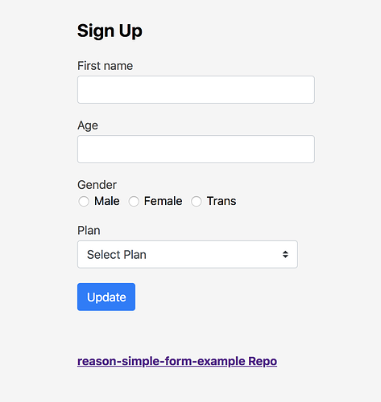

# Pendahuluan

## Sekilas tentang Paradigma Pemrograman


Paradigma adalah sudut pandang tertentu yang digunakan terhadap suatu problem, realitas, keadaan dan sebagainya. Paradigma membatasi dan mengkondisikan jalan berpikir seseorang, mengarahkannya terhadap beberapa atribut dan mengabaikan atribut lain, sehingga paradigma hanya memberikan pandangan yang terbatas terhadap sebuah realitas.

Secara umum, ada 4 paradigma pemrograman, yaitu: Imperatif/Procedural, Object Oriented, Functional, dan Declarative/Predicative/Logic.

### Imperatif/Prosedural
  
Paradigma imperatif dalam pemrograman merujuk pada pendekatan dalam penulisan kode yang berfokus pada urutan instruksi yang harus dieksekusi oleh komputer untuk mencapai suatu tujuan.

Paradigma ini didasari oleh konsep mesin Von Newman (stored program concept) sekelompok tempat penyimpanan (memori), yang dibedakan menjadi memori instruksi dan memori data, masing-masing memori tersebut dapat diberi nama dan nilai, selanjutnya instruksi akan dieksekusi satu persatu secara sekuensial oleh sebuah proses tunggal.

Kelebihan dari paradigma ini adalah efisiensi eksekusi karena lebih dekat dengan konsep mesin, relatif paling mudah dipelajari dibanding paradigma lain. Sedangkan kekurangannya, pada program yang berskala besar, kompleksitas programnya akan jauh bertambah besar seiring dengan bertambahkan ukuran program.

Contoh bahasa pemrogaman yang menggunakan paradigma prosedural atau imperatif adalah: Pascal, Fortran, Basic, Cobol, C, ...
  
### Object Oriented (OOP)
  
Paradigma Pemrograman Berorientasi Objek (OOP) menggunakan konsep class dan object, object adalah instansiasi dari class, setiap object akan mempunyai attribute dan method, masing-masing object dapat berinteraksi dengan object lainnya meskipun berasal dari class yang berbeda.

mempunyai hirarki artinya sebuah class dapat diturunkan menjadi sebuah class baru yang juga memiliki attribut dan method class diatasnya. Dengan begitu dalam paradigma ini dikenal konsep modularitas, penggunaan kembali (reuse) serta kemudahan modifikasi.

Contoh bahasa pemrograman yang menggunakan paradigma ini adalah: _Smalltalk, Delphi, Java, C#, VB.NET,..._

### Functional
  
Paradigma dengan pendekatan yang berfokus pada penggunaan fungsi sebagai unit dasar dari komputasi dan penanganan data. Dalam paradigma ini, fungsi dianggap sebagai objek yang dapat dipindahkan dan digunakan dalam cara yang sama seperti nilai-nilai lainnya.

Paradigma fungsional menekankan pada penghindaran perubahan keadaan dan mutasi data, serta mengutamakan komputasi yang bersifat deklaratif dan tanpa efek samping.

Contoh bahasa pemrograman yang menggunakan paradigma fungsional adalah _LOGO, LISP, Scheme, Haskell, ..._

### Declarative/Logic/Predicative
  
Paradigma dengan  pendekatan di mana program direpresentasikan sebagai kumpulan fakta dan aturan logis, dan komputasi dijalankan dengan menggunakan inferensi logis untuk mencari solusi.

Dalam paradigma ini, programmer mendeskripsikan relasi antara fakta-fakta dan aturan-aturan yang berlaku dalam domain masalah, dan sistem pemrograman logika menggabungkan informasi ini untuk mencapai tujuan yang diinginkan.

Contoh bahasa pemrograman yang menggunakan paradigma ini adalah: _Prolog_.


## Pengantar Object Oriented Programming (OOP)
* PBO/OOP (Object Oriented Programming) adalah suatu metode pemrograman yang berorientasi kepada objek.
* Tujuan dari OOP diciptakan adalah untuk mempermudah pengembangan program dengan cara mengikuti model yang telah ada di kehidupan sehari-hari.
* Jadi setiap bagian dari suatu permasalahan adalah objek, nah objek itu sendiri merupakan gabungan dari beberapa objek yang lebih kecil lagi.
* Contoh 1: Pesawat, Pesawat adalah sebuah objek. Pesawat itu sendiri terbentuk dari beberapa objek yang lebih kecil lagi seperti mesin, roda, baling-baling, kursi, dll. Pesawat sebagai objek yang terbentuk dari objekobjek yang lebih kecil saling berhubungan, berinteraksi, berkomunikasi dan saling mengirim pesan kepada objek-objek yang lainnya.
* Contoh 2: Sebuat form terdiri dari komponen input box, dropdown dan button. Masing-masing komponen itu memiliki atribut warna tulisan, lebar box, jenis tulisan.
  
 
### Alasan menggunakan paradigma OOP
* **Real world programming:** Kode program seperti objek dunia nyata. Hal ini membuat program proses penyusunan program menjadi sesuatu yang intuitif
* **Reusability of code:** Mendorong developer untuk membuat kode program yang bisa dipakai ulang untuk keperluan serupa.
* **Resilience to change:** Proses maintenance dan pengembangan program bisa dibuat pada objek yang spesifik, sehingga mengurangi error dan membantu proses debugging.
* **Information hiding:** Proteksi/menyembungikan sebagian proses, masing-masing developer bisa fokus pada bidang yang menjadi bagiannya.
* **Modularity of code:** Membagi program yang kompleks menjadi bagian-bagian kecil sehingga lebih mudah untuk dibuat dan di-maintenance.

## Batasan OOP
* Kode program relatif lebih banyak
* Performance berkurang

## Perbandingan Kode Program Imperatif vs OOP
Berikut ini perbandingan kode program Python yang ditulis menggunakan paradigma _imperatif_ dan _OOP_.

**Imperatif**
```python
def hitung_luas_persegi_panjang(panjang, lebar):
    return panjang * lebar

panjang = 10
lebar = 5
luas = hitung_luas_persegi_panjang(panjang, lebar)
print("Luas:", luas)
```

**OOP**
```python
class PersegiPanjang:
    def __init__(self, panjang, lebar):
        self.panjang = panjang
        self.lebar = lebar

    def hitung_luas(self):
        return self.panjang * self.lebar

persegi_panjang = PersegiPanjang(10, 5)
print("Luas:", persegi_panjang.hitung_luas())
```

## Elemen-elemen Penting OOP
- **Class:** template yang digunakan untuk membuat objek.\
  Class merupakan sebuah prototipe atau blueprints yang mendefinisikan variabel-variabel dan method-method secara umum.\
  Sebuah program yang utuh terdiri dari beberapa class yang saling berinteraksi satu sama lain. Class yang serupa atau memiliki kesamaan dikumpulkan dalam satu paket (module).
- **Object:** hasil _instansiasi_/turunan dari suatu class.\
  Dalam kode program, Class harus diimplementasikan menjadi sebuah objek, karena class tidak bisa langsung digunakan. Objek disebut juga dengan instance dari suatu class.

- **Attribute/Property:** Atribut adalah data yang membedakan antara objek satu dengan yang lainnya.\
  Atribut dibedakan menjadi dua jenis yaitu _Instance Variable_ dan _Class Variable_.
  _Instance Variable_ adalah atribut untuk tiap objek yang kelasnya sama.
  _Class Variable_ adalah atribut untuk semua objek yang dibuat dari class yang sama.

- **Method/Function/Procedure:** serangkaian kode program dalam suatu _class_ yang melakukan tugas tertentu.\
  Kode program dalam _method_ biasanya bertugas mengekseksi perintah tertentu, memodifikasi atau mengambil nilai pada atribut. Method juga digunakan untuk objek berkomunikasi dengan objek yang lain. 
  
- **Parameter:** Memanggil method bisa juga disertai dengan parameter.
  Parameter adalah nilai yang diberikan kepada suatu fungsi atau metode ketika dipanggil. Parameter digunakan untuk memberikan informasi yang diperlukan untuk menjalankan fungsi atau metode tersebut.

> 💡 Check [Latihan 1](latihan/latihan-01.md)


## Referensi

**PPTX**
- https://ndoware.com/paradigma-pemrograman.html
- https://www.scaler.com/topics/oops-advantages/