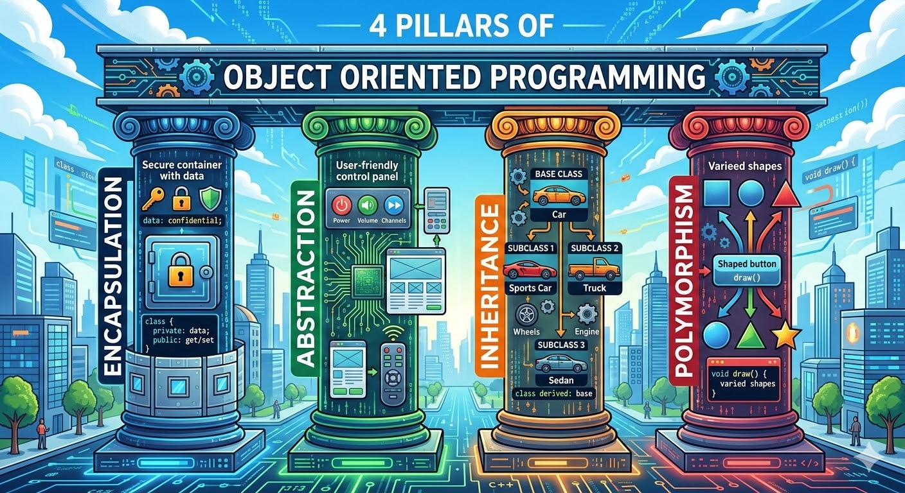

# 4 Prinsip OOP
Ada 4 Prinsip Utama dalam Pemrograman Berorientasi Objek (OOP):
1. [Encapsulation](03-encapsulation.md)
2. [Inheritance](03-inheritance.md)
3. [Polymorphism](03-polymorphism.md)
4. [Abstraction](03-abstraction.md)

