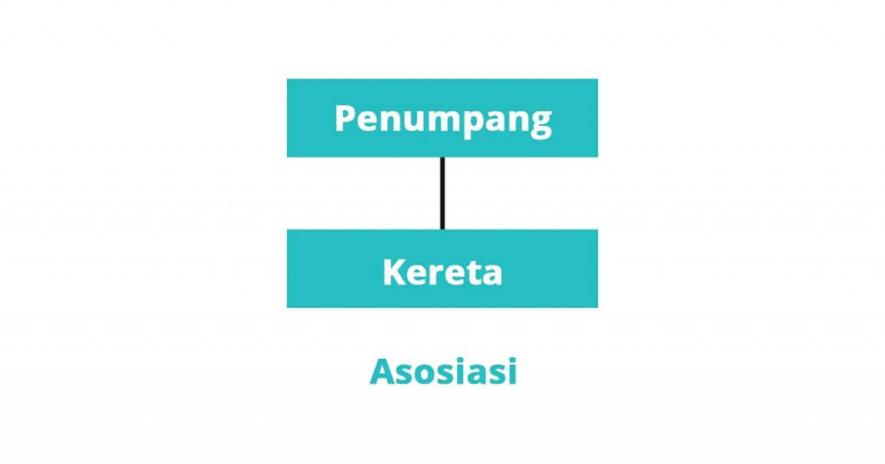

# Class Diagram

Class diagram adalah salah satu jenis diagram dalam _Unified Modeling Language_ (UML) yang digunakan untuk memodelkan struktur _class_ yang digunakan dalam pengembangan perangkat lunak. Diagram ini menggambarkan _class_ dalam sistem, atribut, metode (fungsi), dan hubungan antar _class_.

## Fungsi class diagram
Diagram kelas ini memiliki beberapa fungsi, fungsi utamanya yaitu menggambarkan struktur dari sebuah sistem. Berikut ini adalah fungsi-fungsi lainnya:
* Menunjukan struktur dari suatu sistem dengan jelas.
* Meningkatkan pemahaman tentang gambaran umum atau skema dari suatu program.
* Dapat digunakan untuk analisis bisnis dan digunakan untuk membuat model sistem dari sisi bisnis.
* Dapat memberikan gambaran mengenai sistem atau perangkat lunak serta relasi-relasi yang terkandung di dalamnya.
* Menjelaskan suatu model data untuk sebuah program, baik model data sederhana maupun kompleks.
* Memberikan gambaran umum tentang skema aplikasi dengan jelas dan lebih baik.
* Membantu kamu untuk menyampaikan kebutuhan dari suatu sistem.

## Komponen penyusun class diagram
Diagram kelas memiliki tiga komponen penyusun. Berikut ini adalah komponen-komponennya:

- Komponen atas: Komponen ini berisikan nama class. Setiap class pasti memiliki nama yang berbeda-beda, sebutan lain untuk nama ini adalah simple name (nama sederhana).
- Komponen tengah: Komponen ini berisikan atribut dari class, komponen ini digunakan untuk menjelaskan kualitas dari suatu kelas. Atribut ini dapat menjelaskan dapat ditulis lebih detail, dengan cara memasukan tipe nilai.
- Komponen bawah: Komponen ini menyertakan operasi yang ditampilkan dalam bentuk daftar. Operasi ini dapat menggambarkan bagaimana suatu class dapat berinteraksi dengan data.

## Hubungan antar kelas
Setelah kita mengetahui penjelasan tentang diagram kelas, sekarang kita akan membahas hubungan antar kelasnya. Ada tiga hubungan dalam diagram kelas. Berikut ini adalah penjelasannya:

### Asosiasi
Asosiasi dapat diartikan sebagai hubungan antara dua class yang bersifat statis. Biasanya asosiasi menjelaskan class yang memiliki atribut tambahan seperti class lain.

### Agregasi
Agregasi adalah hubungan antara dua class di mana salah satu class merupakan bagian dari class lain, tetapi dua class ini dapat berdiri masing-masing.

### Pewarisan
Pewarisan atau inheritance dapat disebut juga generalization dalam class diagram adalah suatu kemampuan untuk mewarisi seluruh atribut dan metode dari class asalnya (superclass) ke class lain (subclass).

### Contoh
Berikut ini adalah contoh dari diagram kelas sistem perpustakaan.

---
*Referensi:*
- https://www.dicoding.com/blog/memahami-class-diagram-lebih-baik/
- https://www.visual-paradigm.com/guide/uml-unified-modeling-language/what-is-class-diagram/