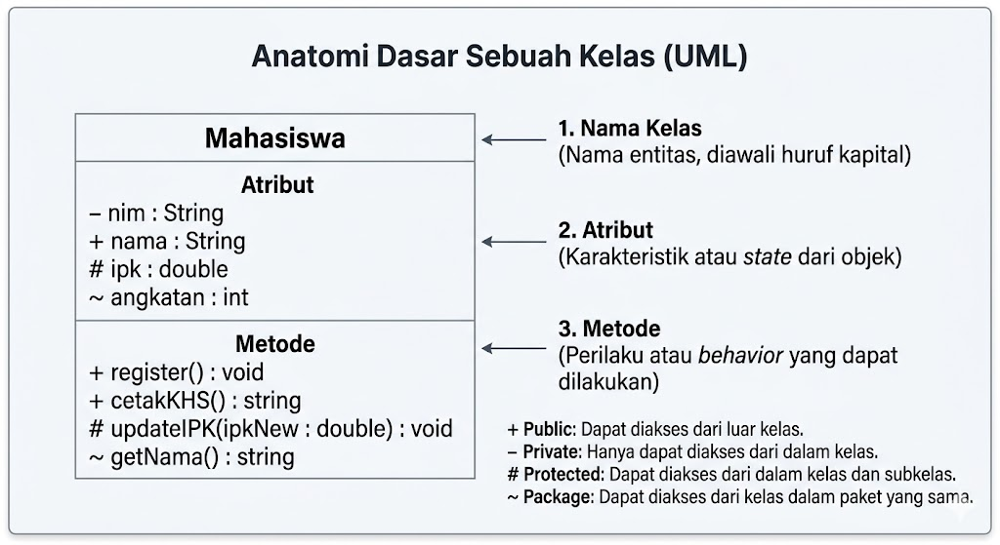
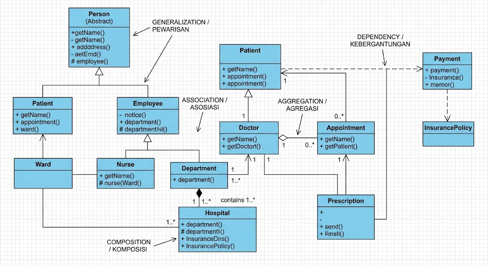
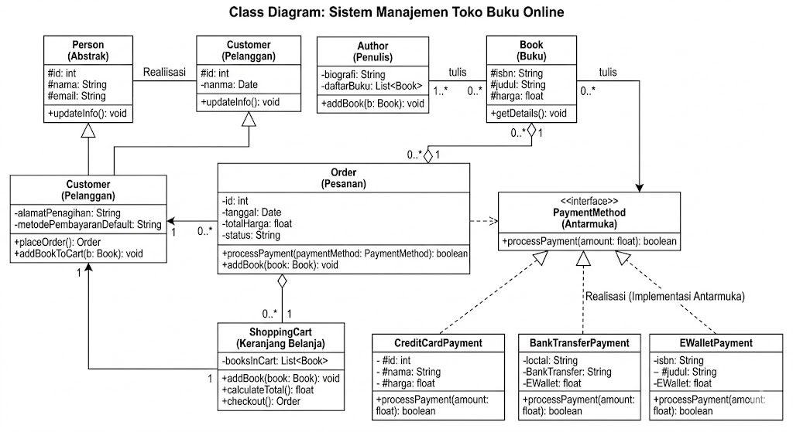
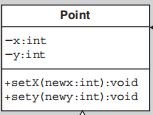

## 1. Apa itu Class Diagram?

Class Diagram adalah jenis diagram struktur statis dalam UML yang menggambarkan struktur suatu sistem dengan memodelkan kelas-kelas, atribut, metode (operasi), serta hubungan antar objek. Diagram ini merupakan tulang punggung dan pondasi utama dalam rekayasa perangkat lunak berorientasi objek (Object-Oriented Programming).

## 2. Anatomi Dasar Sebuah Kelas



Dalam notasi UML, sebuah kelas digambarkan menggunakan bentuk persegi panjang yang dibagi menjadi tiga kompartemen (baris) mendatar:

- **Bagian Atas (Nama Kelas):** Memuat nama kelas. Ditulis rata tengah dan dicetak tebal (_bold_). Standar penamaan biasanya menggunakan _PascalCase_ (contoh: `Mahasiswa`, `MataKuliah`).
- **Bagian Tengah (Atribut/Properti):** Mendefinisikan karakteristik atau _state_ dari objek.
    - Format penulisan: `[visibility] namaAtribut : TipeData`
    - Contoh:
	    - `- nim : String`
	    - `+ nama : String`
- **Bagian Bawah (Operasi/Metode):** Mendefinisikan perilaku atau _behavior_ yang dapat dilakukan oleh objek tersebut.
    - Format penulisan: `[visibility] namaMetode(parameter) : TipeKembalian`
    - Contoh:
	    - `+ register() : void`
	    - `cetakKHS() : String`

## 3. Tingkat Visibilitas (Access Modifiers)

UML menggunakan simbol khusus yang ditempatkan sebelum nama atribut atau metode untuk menentukan hak aksesnya (Enkapsulasi):
- `+` **Public:** Elemen dapat diakses dari kelas mana saja.
- `-` **Private:** Elemen hanya dapat diakses dari dalam kelas itu sendiri.
- `#` **Protected:** Elemen dapat diakses oleh kelas itu sendiri dan kelas turunannya (_subclass_).
- `~` **Package (Default):** Elemen dapat diakses oleh kelas lain yang berada dalam direktori/paket yang sama.

## 4. Jenis-jenis Relasi Antar Kelas

Sistem yang baik terdiri dari kelas-kelas yang saling berkolaborasi. Memahami relasi sangat krusial dalam perancangan UML.

**🎫 Contoh 1**



**🎫 Contoh 2**


- **Generalization (Pewarisan/Inheritance):** Menunjukkan hubungan "is-a" antara _superclass_ dan _subclass_.
        
- **Realization (Implementasi):** Hubungan antara antarmuka (_interface_) yang mendefinisikan kontrak, dengan kelas yang mengimplementasikannya.
        
- **Association (Asosiasi):** Asosiasi dapat diartikan sebagai hubungan antara dua class yang bersifat statis. Biasanya asosiasi menjelaskan class yang memiliki atribut tambahan seperti class lain.
        
- **Aggregation (Agregasi):** Hubungan "has-a" yang bersifat lemah. Hubungan antara dua class di mana salah satu class merupakan bagian dari class lain, tetapi dua class ini dapat berdiri masing-masing. Contoh: `Dosen` dan `Jurusan`.
        
- **Composition (Komposisi):** Hubungan "part-of" yang bersifat kuat. Siklus hidup objek bagian bergantung penuh pada objek utama. Jika kelas utama dihapus, kelas bagian juga ikut terhapus. Contoh: `Rumah` dan `Kamar`.
        
- **Dependency (Kebergantungan):** Hubungan di mana perubahan struktur pada satu kelas akan memengaruhi kelas lain yang menggunakannya (biasanya sebagai parameter metode).
        


## 5. Contoh Implementasi

Berikut adalah translasi desain UML di atas ke dalam dua bahasa pemrograman: Java dan Python.



Jika class diagram di atas diubah menjadi source code, maka akan menjadi seperti berikut:

```java
public class Point {
    private int x;
    private int y;
    
    public setX(int x) {
        this.x = x;
    }
    
    public setY(int y) {
        this.y = y;
    }
}
```

---

*Referensi:*
- https://www.dicoding.com/blog/memahami-class-diagram-lebih-baik/
- https://www.visual-paradigm.com/guide/uml-unified-modeling-language/what-is-class-diagram/