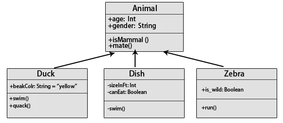
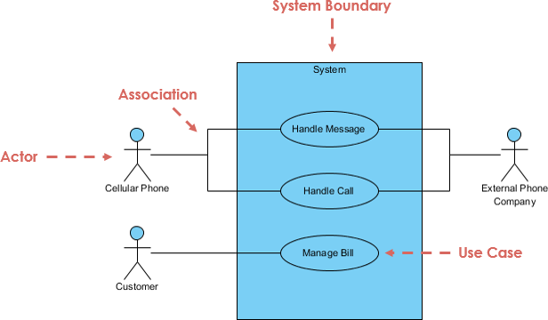

## Pendahuluan

**Unified Modeling Language (UML)** adalah bahasa pemodelan visual berstandar industri yang digunakan untuk merancang, mendokumentasikan, dan memvisualisasikan arsitektur sebuah sistem perangkat lunak, khususnya pada sistem berbasis _Object-Oriented_ (Berorientasi Objek).

Sederhananya, UML ibarat **cetak biru (blueprint)** dalam pembangunan rumah. Sebelum mulai membangun, arsitek membuat denah agar tukang tahu apa yang harus dikerjakan. Demikian juga dalam rekayasa perangkat lunak, UML membantu _developer_ melihat gambaran besar sistem sebelum mulai menulis kode.

### Fungsi Utama UML

- **Bahasa Komunikasi Universal:** Memberikan standar visual yang seragam agar spesifikasi sistem dapat dipahami oleh berbagai pihak, mulai dari analis bisnis, _programmer_, hingga klien.
    
- **Perancangan Sistem:** Membantu merancang arsitektur sistem secara matang guna meminimalisir kesalahan fundamental (seperti cacat logika) sebelum masuk ke fase implementasi atau _coding_.
    
- **Dokumentasi Terstruktur:** Menjadi rekam jejak teknis yang sangat berguna untuk keperluan pemeliharaan (_maintenance_) atau pengembangan sistem (_scale-up_) di masa depan.
    
---

### Dua Kategori Utama Diagram UML

UML memiliki lebih dari 10 jenis diagram, namun semuanya dikelompokkan ke dalam dua kategori besar: **Structure Diagrams (Diagram Struktural)** dan **Behavior Diagrams (Diagram Perilaku)**
    
### Structure Diagrams

Jika sebuah sistem perangkat lunak diibaratkan sebagai sebuah gedung, Structure Diagrams adalah gambar arsitektur dan struktur tekniknya. Diagram ini menunjukkan pondasi, pilar, tata letak ruangan, dan jaringan kabelnya. Sifatnya **statis**—artinya diagram ini tidak menunjukkan waktu, urutan kejadian, atau pergerakan data, melainkan fokus pada _apa saja komponen yang membentuk sistem_ dan _bagaimana mereka saling terhubung_.

Berikut adalah penjelasan rinci mengenai jenis-jenis Structure Diagrams yang paling sering digunakan dalam industri rekayasa perangkat lunak:

#### 1. Class Diagram (Diagram Kelas)

Seperti yang sudah kita bahas, ini adalah diagram paling fundamental dalam UML. Class Diagram mendefinisikan tipe objek (kelas) dalam sistem beserta atribut, operasi (metode), dan hubungan antar kelas (seperti pewarisan atau agregasi). Ini adalah cetak biru utama sebelum mulai menulis kode.

#### 2. Object Diagram (Diagram Objek)

Jika Class Diagram adalah cetak biru, maka Object Diagram adalah **foto polaroid (snapshot)** dari sistem pada satu waktu tertentu.

- **Fungsi:** Diagram ini menampilkan _instance_ (wujud nyata) dari kelas-kelas beserta nilai atributnya saat sistem sedang berjalan.
    
- **Kapan digunakan:** Sangat berguna untuk menguji dan memvalidasi apakah Class Diagram yang dibuat sudah logis ketika diisi dengan data nyata yang kompleks.
    

#### 3. Component Diagram (Diagram Komponen)

Diagram ini melihat sistem dari sudut pandang yang lebih tinggi (_high-level_). Sistem yang besar biasanya dipecah menjadi beberapa komponen modular (modul independen yang dapat diganti atau digunakan ulang).

- **Fungsi:** Menggambarkan organisasi dan kebergantungan antar komponen perangkat lunak, seperti pustaka (_libraries_), basis data, UI, dan modul layanan (_services_).
    
- **Contoh:** Dalam sistem e-commerce, Anda bisa memiliki komponen `Shopping Cart`, komponen `Payment Gateway`, dan komponen `Inventory`, lalu menunjukkan bagaimana komponen `Shopping Cart` bergantung pada layanan dari `Payment Gateway`.
    
#### 4. Deployment Diagram (Diagram Deployment)

Diagram ini memetakan dunia perangkat lunak (_software_) ke dunia fisik (_hardware_). Diagram ini digunakan untuk memetakan arsitektur modul sistem

- **Fungsi:** Menunjukkan arsitektur fisik tempat perangkat lunak akan diinstal dan dijalankan (_deployed_). Diagram ini memvisualisasikan "node" (seperti server, komputer klien, perangkat mobile) dan artefak (komponen software) yang ada di dalamnya, beserta protokol komunikasi jaringannya.
    
- **Contoh:** Menunjukkan bahwa `Web Application` di-_deploy_ di _Server Ubuntu_, sedangkan `Database` berada di _Server AWS RDS_, dan keduanya berkomunikasi melalui protokol `TCP/IP`.
    

#### 5. Package Diagram (Diagram Paket)

Ketika sistem menjadi sangat besar, Class Diagram bisa terlihat sangat ruwet (seperti mie yang kusut). Package Diagram digunakan untuk merapikannya.

- **Fungsi:** Mengelompokkan elemen-elemen UML yang saling berkaitan (seperti kelas, antarmuka, atau komponen) ke dalam wadah logis yang disebut "Package" (mirip seperti folder dalam sistem operasi).
    
- **Kapan digunakan:** Untuk menunjukkan arsitektur lapisan (_layered architecture_) pada sistem, misalnya memisahkan lapisan `Presentation (UI)`, `Business Logic`, dan `Data Access`.
    

#### 6. Composite Structure Diagram (Diagram Struktur Komposit)

Diagram ini bertindak seperti mikroskop yang melihat ke _dalam_ sebuah kelas atau komponen.

- **Fungsi:** Menampilkan struktur internal dari sebuah komponen yang kompleks, termasuk bagian-bagiannya (parts), port (titik interaksi dengan dunia luar), dan konektor antar bagian tersebut.
    
- **Kapan digunakan:** Ketika Anda memiliki kelas atau komponen yang sangat besar dan rumit, dan Anda perlu merancang cara kerja internalnya tanpa harus mengeksposnya ke luar.

---

### **Behavior Diagrams**

Melanjutkan analogi kita sebelumnya, jika **Structure Diagrams** adalah cetak biru fisik dan tata letak sebuah gedung, maka **Behavior Diagrams** adalah _SOP (Standard Operating Procedure)_ atau aktivitas manusia di dalam gedung tersebut dari waktu ke waktu.

Diagram ini bersifat **dinamis**. Fokus utamanya bukan pada bentuk fisik kodenya, melainkan pada _bagaimana_ sistem bekerja, bergerak, mengubah status, dan merespons suatu kejadian (_event_). Diagram perilaku sangat krusial untuk memvalidasi apakah logika bisnis (_business logic_) sistem sudah berjalan sesuai dengan kebutuhan pengguna.

Berikut adalah penjelasan rinci tentang jenis-jenis Behavior Diagrams yang paling penting untuk dikuasai:

#### 1. Use Case Diagram (Diagram Kasus Penggunaan)

Ini adalah diagram yang paling mudah dipahami oleh orang non-teknis (seperti klien atau analis bisnis) karena tidak menampilkan detail kode sama sekali.

- **Fungsi:** Menggambarkan sistem dari sudut pandang interaksi antara pengguna (_Actor_) dan fitur-fitur yang disediakan oleh sistem tersebut (_Use Case_). Diagram ini menjawab pertanyaan: _"Siapa yang menggunakan sistem ini, dan apa yang bisa mereka lakukan?"_
        
- **Kapan Digunakan:** Pada fase awal analisis kebutuhan untuk menyepakati ruang lingkup (_scope_) aplikasi dengan klien, memetakan interaksi antara manusia dan fitur aplikasi secara umum.

#### 2. Activity Diagram (Diagram Aktivitas)

Jika Anda familier dengan _flowchart_ (diagram alir), Activity Diagram adalah versi UML yang lebih modern dan canggih dari _flowchart_.

- **Fungsi:** Memvisualisasikan alur kerja (_workflow_) dari sebuah proses bisnis atau aktivitas operasional secara berurutan, dari titik awal hingga titik akhir.
    
- **Kelebihan:** Berbeda dengan _flowchart_ biasa, Activity Diagram mampu menggambarkan proses paralel (dua aktivitas yang berjalan bersamaan) menggunakan simbol _fork_ dan _join_, serta membagi tugas berdasarkan aktor menggunakan jalur-jalur (_Swimlanes_).
    
- **Kapan Digunakan:** merancang alur prosedur kerja atau perjalanan pengguna. 
    

#### 3. Sequence Diagram (Diagram Urutan)

Ini adalah diagram perilaku yang sangat teknis dan menjadi jembatan langsung sebelum melakukan proses _coding_.

- **Fungsi:** Menunjukkan bagaimana objek-objek di dalam sistem saling berkomunikasi dari waktu ke waktu. Diagram ini dibaca dari atas ke bawah untuk melihat urutan pertukaran pesan (_message_) antar objek.
    
- **Komponen Utama:** * _Lifeline_ (garis vertikal putus-putus) yang mewakili umur hidup sebuah objek.
    
    - Pesan (panah horizontal) yang merepresentasikan pemanggilan metode (_method call_) atau pengembalian nilai (_return value_).
        
- **Kapan Digunakan:** Sangat berguna bagi _programmer_ (khususnya _backend_ dan perancang logika OOP) untuk memahami alur eksekusi logika sebuah fitur secara rinci, misalnya: bagaimana halaman Web meminta data dari Controller, lalu Controller mengambil data dari Database.
    

#### 4. State Machine Diagram (Diagram Mesin Status)

Diagram ini memiliki fokus yang sangat spesifik dan mikroskopis dibandingkan diagram perilaku lainnya.

- **Fungsi:** Melacak perubahan status (_state_) dari **satu objek tunggal** sepanjang siklus hidupnya, yang dipicu oleh kejadian (_event_) tertentu.
    
- **Contoh Kasus:** Bayangkan objek `Pesanan`. Status awalnya adalah `Draft`. Jika terjadi event "Checkout", statusnya berubah menjadi `Menunggu Pembayaran`. Jika event "Uang Diterima" terjadi, statusnya menjadi `Diproses`, dan seterusnya.
    
- **Kapan Digunakan:** Ketika mau mengunci logika perubahan status pada satu entitas penting (seperti sistem persetujuan dokumen, mesin ATM, atau keranjang belanja _e-commerce_).
        
