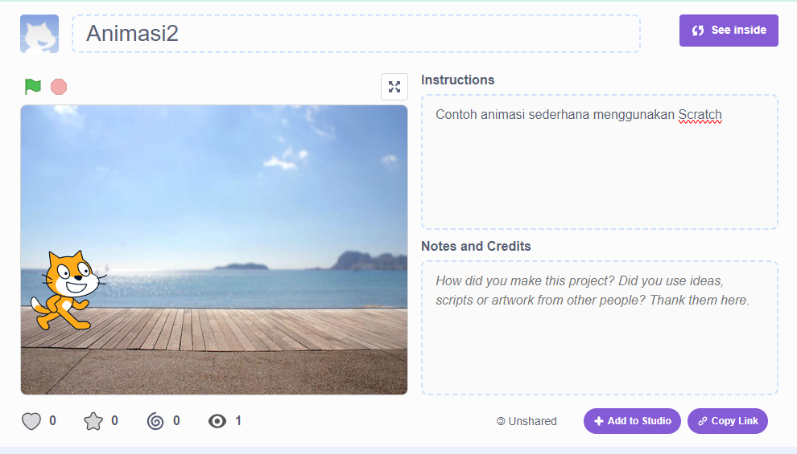
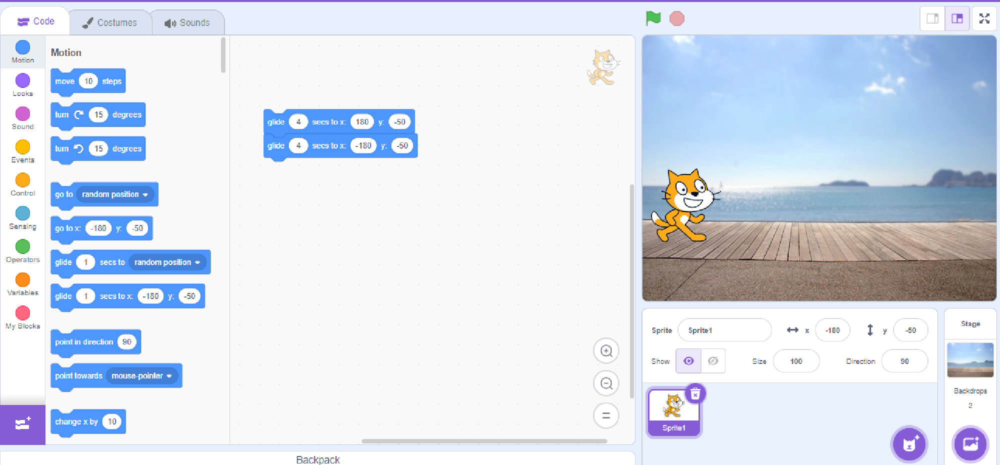

# Latihan 1: Membuat animasi sederhana menggunakan Scratch

Coba membuat animasi menggunakan [Scratch](https://scratch.mit.edu/)

Buka project https://scratch.mit.edu/projects/985625672 sebagai contoh.

**Tugas**
- Pelajari mana yang disebut _class, object, method, parameter_ pada animasi di Scratch.